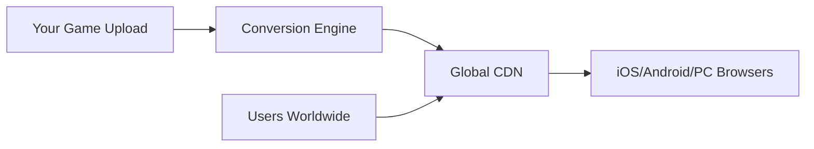

## Overview

Nothing2Install enables you to convert mobile games to HTML5 in seconds, stream them instantly via browser, and distribute across iOS, Android, and PC without downloads. You gain scalable cloud infrastructure for worldwide availability and tools to boost retention on game portals. These features transform your game catalog into accessible, high-performance web experiences.

<Columns cols={2}>
  <Card title="Instant Conversion" icon="zap" href="/quickstart">
    Convert APK files to HTML5 in under 10 seconds.
  </Card>
  <Card title="Cross-Platform Play" icon="globe" href="#cross-platform">
    Seamless playback on any device or browser.
  </Card>
  <Card title="Global Scaling" icon="trending-up" href="#scaling">
    Handle millions of concurrent users effortlessly.
  </Card>
  <Card title="Retention Boost" icon="heart" href="#retention">
    Integrate ads and IAP for better engagement.
  </Card>
</Columns>

## HTML5 Conversion Process

Convert your mobile games to web-playable HTML5 instantly. Upload your APK or game bundle, and Nothing2Install handles the rest automatically.

<Steps>
  <Step title="Upload Game" icon="upload">
    Use the dashboard or API to upload your game file.
  </Step>
  <Step title="Auto-Convert" icon="zap">
    The platform processes conversion in seconds, optimizing for web.
  </Step>
  <Step title="Get Embed Code" icon="code">
    Receive ready-to-use HTML5 embed code or streaming URL.
  </Step>
  <Step title="Deploy" icon="rocket">
    Integrate into your site or portal and go live worldwide.
  </Step>
</Steps>

<Callout kind="tip">
  Conversions preserve original graphics, controls, and performance. Test on the [demo page](https://minio-shared-ff.n2i-cache.xyz/superapp/pages/master/index.html?customer=n2i) for US, JP, EU, IN, and ME servers.
</Callout>

## Cross-Platform Compatibility

Your converted games run smoothly on iOS, Android, and PC browsers. No app stores or downloads required—players access via standard web links.

<Tabs>
  <Tab title="iOS" icon="apple">
    Embed in Safari or any iOS browser. Supports touch controls natively.

````html
<iframe
  src="https://stream.example.com/game?id=your-game-id&key=YOUR_API_KEY"
  width="100%"
  height="600"
  frameborder="0">
</iframe>
````
  </Tab>
  <Tab title="Android" icon="android">
    Optimized for Chrome on Android. Handles fullscreen and orientation changes.

````html
<iframe
  src="https://stream.example.com/game?id=your-game-id&platform=android"
  width="100%"
  height="600"
  allowfullscreen>
</iframe>
````
  </Tab>
  <Tab title="PC" icon="monitor">
    Full keyboard/mouse support for desktop browsers.

````html
<iframe
  src="https://stream.example.com/game?id=your-game-id&platform=pc"
  width="100%"
  height="600"
  style="border: none;">
</iframe>
````
  </Tab>
</Tabs>

## Scalable Cloud Infrastructure

Nothing2Install's cloud streams games to users worldwide with ultra-low latency. Auto-scale to millions of sessions without infrastructure management.



<Expandable title="Advanced Scaling Options" default-open="false">
  Configure regions and concurrency limits via API.

<CodeGroup tabs="JavaScript,cURL">
  ```javascript
  const response = await fetch('https://api.example.com/games/scale', {
    method: 'POST',
    headers: { 'Authorization': 'Bearer YOUR_API_KEY' },
    body: JSON.stringify({
      regions: ['US', 'EU', 'JP'],
      maxConcurrent: 1000000
    })
  });
  ```
  ```bash
  curl -X POST https://api.example.com/games/scale \
    -H "Authorization: Bearer YOUR_API_KEY" \
    -d '{"regions":["US","EU","JP"],"maxConcurrent":1000000}'
  ```
</CodeGroup>
</Expandable>

## Retention Tools for Game Portals

Enhance player retention with ad integration and in-app purchases. Nothing2Install's Ad-Bridge plugin supports major networks, increasing revenue while improving engagement.

| Feature | Benefit | Supported Networks |
|---------|---------|--------------------|
| Ad Breaks | Monetize sessions | Google AdMob, Unity Ads |
| IAP Passthrough | Seamless purchases | Apple Pay, Google Play |
| Analytics | Track retention | Custom webhooks |

<Callout kind="success">
  Portals report 30% higher retention after integrating Nothing2Install games.
</Callout>

Integrate ads via simple SDK calls:

<CodeGroup tabs="JavaScript,Unity">
  ```javascript
  // Trigger rewarded ad before level start
  N2IAds.showRewarded('level-start', () => {
    loadNextLevel();
  });
  ```
  ```csharp
  // Unity C# example
  N2IAds.Instance.ShowRewardedAd("level-start", OnAdComplete);
  void OnAdComplete() {
      LoadNextLevel();
  }
  ```
</CodeGroup>

## Next Steps

<Columns cols={2}>
  <Card title="Quickstart" icon="book-open" href="/quickstart" horizontal>
    Convert your first game in minutes.
  </Card>
  <Card title="API Reference" icon="code" href="/authentication" horizontal>
    Integrate programmatically.
  </Card>
</Columns>

<Callout kind="info">
  This starter documentation showcases Nothing2Install's core features. Customize for your needs and explore the demo for hands-on experience.
</Callout>